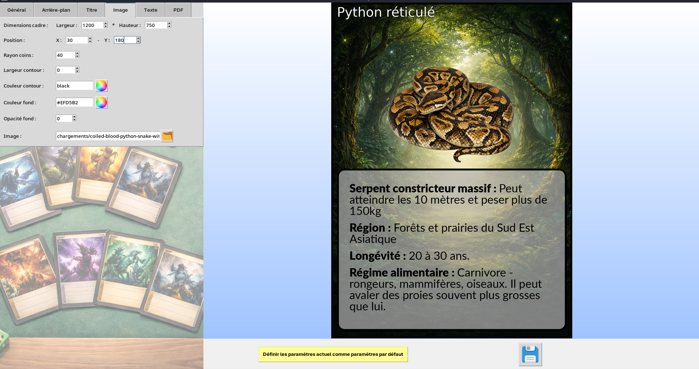

# 🎴 Générateur de Cartes Personnalisées (Tkinter)

Application desktop en **Python** permettant de concevoir visuellement des cartes personnalisées (type cartes à jouer, cartes pédagogiques, cartes personnages, etc.), avec :

*   Prévisualisation en temps réel
    
*   Gestion fine des polices et des blocs de texte
    
*   Insertion d’image
    
*   Arrière-plan personnalisable
    
*   Export en **JPEG**
    
*   Génération d’un **PDF multi-cartes** prêt à imprimer (format A4)
    

Interface graphique développée avec **Tkinter**, génération d’images via **Pillow** et export PDF via **ReportLab**.

***
##    Exemple



## 🚀 Fonctionnalités principales

### 🎨 Personnalisation complète de la carte

*   Dimensions de la carte (pixels)
    
*   Couleur de fond
    
*   Bordure (couleur + largeur)
    
*   Coins arrondis
    
*   Image d’arrière-plan (avec conservation de ratio)
    
*   Opacité des cadres
    

### 🖼 Gestion de l’image

*   Cadre personnalisable (dimensions, position)
    
*   Coins arrondis
    
*   Couleur et opacité du fond du cadre
    
*   Bordure configurable
    
*   Redimensionnement automatique de la photo avec conservation des proportions
    

### 📝 Gestion avancée du texte

*   Cadre texte indépendant
    
*   Padding configurable
    
*   Police régulière / gras / italique
    
*   Tailles indépendantes
    
*   Couleurs personnalisées
    
*   Ajout dynamique de blocs :
    
    *   `title`
        
    *   `texte`
        
    *   `comment`
        
*   Retour à la ligne automatique (word wrapping)
    

### 🖨 Export

*   Export JPEG haute qualité
    
*   Génération PDF multi-cartes :
    
    *   Format A4
        
    *   Gestion des marges imprimante
        
    *   Redimensionnement automatique
        
    *   Placement optimisé sur la page
        

***

## 📦 Structure du projet

```text
.
├── CardsGenerator.py
├── LICENSE
├── readme.md
├── requirements.txt
├── custom_widgets/
│   ├── CardPreview.py
│   ├── spin_box_pair.py
│   ├── my_spin_box.py
│   ├── color_picker.py
│   ├── background_frame.py
│   └── image_file_picker.py
├── utils/
│   └── printable_pdf_builder.py
├── assets/
│   ├── *.ttf
│   ├── *.png
│   └── background_imgs/
├── config/
├── generated/
└── origin_pics/
``` 

***

## ⚙️ Installation

### 1️⃣ Cloner le dépôt

`git clone https://github.com/ton-utilisateur/card_creator.git cd card_creator` 

### 2️⃣ Créer un environnement virtuel (recommandé)

`python -m venv venv source venv/bin/activate # macOS / Linux venv\Scripts\activate # Windows` 

### 3️⃣ Installer les dépendances

`pip install pillow reportlab` 

***

## ▶️ Lancer l’application

`python CardsGenerator.py` 

L’application s’ouvre en plein écran et permet :

*   Configuration via onglets
    
*   Visualisation en temps réel
    
*   Export image ou PDF
    

***

## 🧠 Architecture technique

### 🔹 `CardPreview`

Composant clé responsable de :

*   Génération de l’image complète via `Pillow`
    
*   Superposition des couches :
    
    *   Fond
        
    *   Image de fond
        
    *   Cadre image
        
    *   Photo
        
    *   Cadre texte
        
    *   Blocs texte
        
*   Redimensionnement dynamique pour affichage dans un `Canvas`
    

### 🔹 Paramétrage centralisé

Tous les paramètres sont stockés dans un dictionnaire `self.params`, sauvegardé via `pickle` dans :

`config/params.pkl` 

Les paramètres sont automatiquement rechargés au démarrage.

***

## 📄 Génération PDF

La génération PDF repose sur :

*   Redimensionnement des images en mm
    
*   Placement optimisé sur page A4
    
*   Gestion des marges imprimante
    
*   Ratio largeur/hauteur conservé
    

⚠️ Toutes les cartes d’un dossier doivent avoir les mêmes dimensions en pixels pour garantir un rendu cohérent.

***

## 🛠 Dépendances

*   Python 3.9+
    
*   Tkinter (inclus avec Python)
    
*   Pillow
    
*   ReportLab
    

***

## 💡 Cas d’usage

*   Cartes pédagogiques
    
*   Jeux de société personnalisés
    
*   Cartes personnages RPG
    
*   Flashcards
    
*   Supports éducatifs imprimables
    

***

## 📌 Améliorations futures possibles

*   Export PNG avec transparence
    
*   Templates prédéfinis
    
*   Gestion multi-cartes en batch
    
*   Export PDF recto-verso
    
*   Packaging en exécutable (PyInstaller)
    

***

## 📜 Licence

Ce projet est distribué sous licence MIT.
Voir le fichier LICENSE pour plus d’informations.